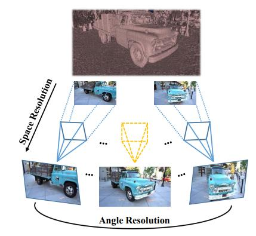

This is the offical implementation of the paper [Space-Angle Super-Resolution for Multi-View Images](https://dl.acm.org/doi/abs/10.1145/3474085.3475244)

# Motivation

<!--  -->

<div align=center>

</div>

Blue and yellow frustums indicate real and virtual views respectively. Our
method can up-sample both the spatial and angular resolutions for multi-view images


# Setup
This code use Ubuntu 16.04.4, CUDA 10.1 and the following Python packages
```
pytorch=1.3.0
torchvision=0.4.1
tensorboardx=2.4
imageio=2.9.0
scikit-image=0.18.1
```

## Build ext:
Our code borrows from [FreeViewSynthesis](https://github.com/isl-org/FreeViewSynthesis), please build the Python extension needed for preprecessing, 
```
cd ext/preprocess
cmake -DCMAKE_BUILD_TYPE=Release .
make 
```

## Build Forward_Warping_min:
We borrow Forward warping from [Forward warping extension](https://github.com/lizhihao6/Forward-Warp) and implement our novel forward depth warping stragegy in Forward_Warping_min. Please follow their install.sh to build this extension.

## Build DCNv2:
We use the Deformable Convolution implementation from the [DCNv2](https://github.com/CharlesShang/DCNv2). Please follow their instruction to build this extension.

# Dataset
We preprocess two public Dataset [Tanks and Temples](https://github.com/isl-org/FreeViewSynthesis), [ETH](https://www.eth3d.net/datasets) for training and evaluation. For ETH, we use 5 scene：*delivery_area, electro, forest, playground, terrains*. You can download our preprocessed version from [baidudisk](https://pan.baidu.com/s/1NcKlDb7ZaCCz6vYnPNm4xg), code : chvb.

# Pretrained Model
You can download our pretrained depth-only and full model from [depth-only](https://drive.google.com/file/d/1eZomptpoa_gorNBUyzyhh5veQua5PxBJ/view?usp=sharing), [full model](https://drive.google.com/file/d/1nO5rhAlcWs9yM370qUh442clpiClxaFP/view?usp=sharing). Place them in 'exp/experiments'

# Train

prepare dataset and updapte config.py with your own path
```
cd exp
$ set train=True in config.py
python exp.py --cmd retrain --iter last --eval-dsets tat --eval-scale 0.5
```


# Eval
```
cd exp
# set train=True in config.py for evaluating Tanks and Temples dataset
# set train=False in config.py for evaluating ETH dataset
python exp.py --cmd eval --iter last --eval-dsets tat --eval-scale 0.5
```

## Citation
if you find this code useful, please cite our paper:
```
@inproceedings{sun2021space,
  title={Space-Angle Super-Resolution for Multi-View Images},
  author={Sun, Yuqi and Cheng, Ri and Yan, Bo and Zhou, Shili},
  booktitle={Proceedings of the 29th ACM International Conference on Multimedia},
  pages={750--759},
  year={2021}
}
```

